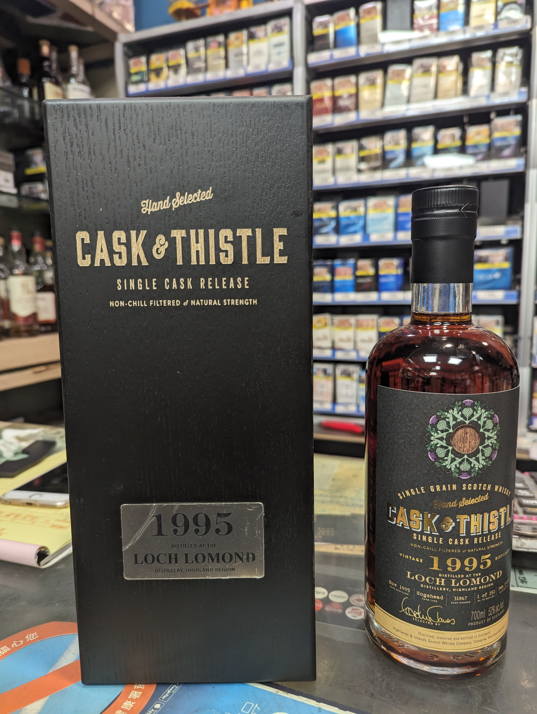
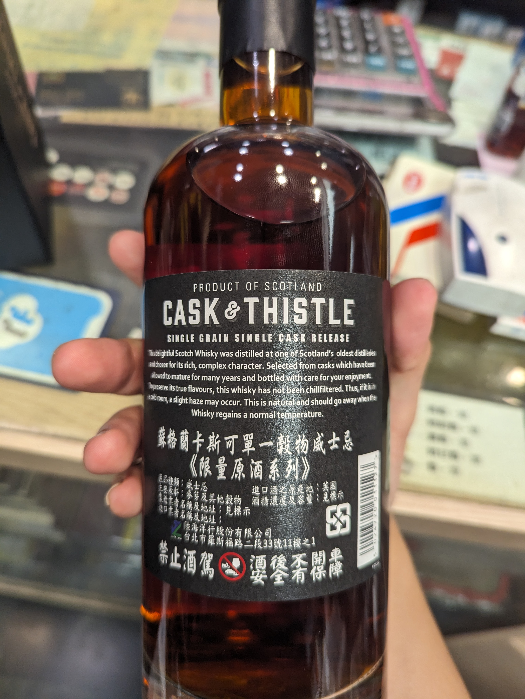

# Loch Lomond Cask&Thistle 1995 27yo HHD 52%

### 【香氣】  
### 【味道】  
### 【結語】
### 【日期】2023.07.16  
### 【評分】  
### 【價格】7950  

官方文宣
榮登 2023年度最推薦作品，此酒款出自蘇格蘭極具實力的全能酒廠 Loch Lomond 羅曼德湖蒸餾廠。座落於英國最大淡水湖畔，Loch Lomond 不僅擁有風光絕美的地理環境，更以「一條龍式釀造流程」聞名於業界，從蒸餾、熟成、裝瓶至貼標，皆由酒廠內部完成，全程控管品質，確保每一滴酒的純淨與獨特性。
此酒款由 Cask & Thistle 精選自1995年蒸餾、熟成逾 27 年的單一麥芽威士忌，以 52% 酒精濃度原桶裝瓶，僅得 252 瓶。完整保留 Loch Lomond 經典的水果調性與圓潤酒體，深刻展現其精湛工藝與時間的淬鍊。
風味筆記
香氣｜ 熟成熱帶水果與柑橘皮交織，伴隨柔順橡木香與輕盈香草氣息。
口感｜ 酒體溫潤滑順，果乾與蜂蜜甜潤融合辛香辛香調性，層次綿密且具平衡感。
尾韻｜ 悠長而優雅，帶有烘烤杏仁與辛香料的尾韻，餘味甘甜耐人尋味。

產品資訊
品牌｜ Cask & Thistle
酒廠｜ Loch Lomond（羅曼德湖蒸餾廠）
蒸餾年份｜ 1995
裝瓶年份｜ 2023
酒精濃度｜ 52%
裝瓶數｜單桶限量252 瓶
這瓶 Loch Lomond 1995 是少見將產區風格、技術底蘊與歷史厚度三者兼具的經典之作，推薦給每一位渴望深入蘇格蘭威士忌靈魂的品飲者與收藏家。

#lochlomond
#cask&thistle
#whisky
#whiskylover
#whiskey
#spicy9night

