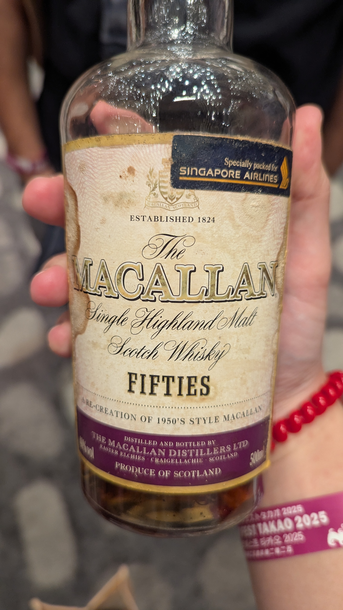

🥃
# Travel Series_Fifties Macallan OB Sherry 40%

### 【結語】陳皮梅、茶餐廳、甜酒、杏仁可頌、花蜜與開心果糖漿，老派麥卡倫(?)
### 【日期】2025.11.22 @高雄酒展

這款酒並非 1950 年蒸餾，而是大約在 1990 年代末期至 2000 年左右蒸餾的。 

這瓶「FIFTIES」屬於麥卡倫的復古年代旅行系列 (Travel Series)，其設計初衷並非使用該年代的陳年原酒，而是透過以下方式調配而成：

重現風格：

由麥卡倫當時的首席釀酒師 David Robertson 主導，透過抽樣酒廠庫存中真正的 1950 年代老酒，分析其香氣與風味特徵。

近代原酒調配： 

釀酒師使用當時（約 1990 年代）酒窖中較年輕、正在熟成的原酒進行勾兌，使其口感儘可能貼近 1950 年代那種帶有細微泥煤煙燻感與濃厚雪莉桶香氣的風格。

裝瓶時間： 

根據資料記載，此系列包含 1950s 版本，大多是在 2000 年或 2001 年進行裝瓶。 

#macallan
#sherry
#whisky
#whiskylover
#whiskey
#spicy9night

