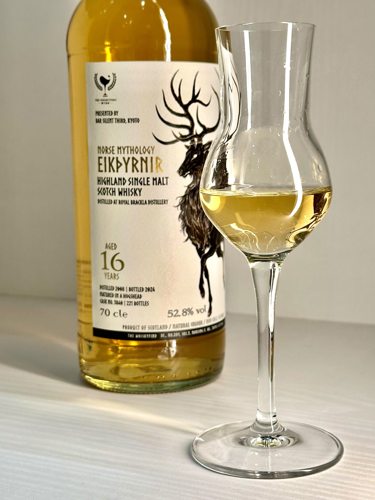
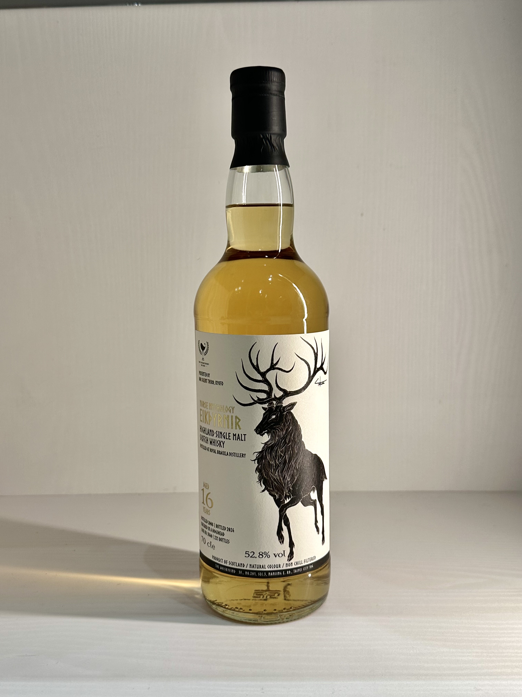
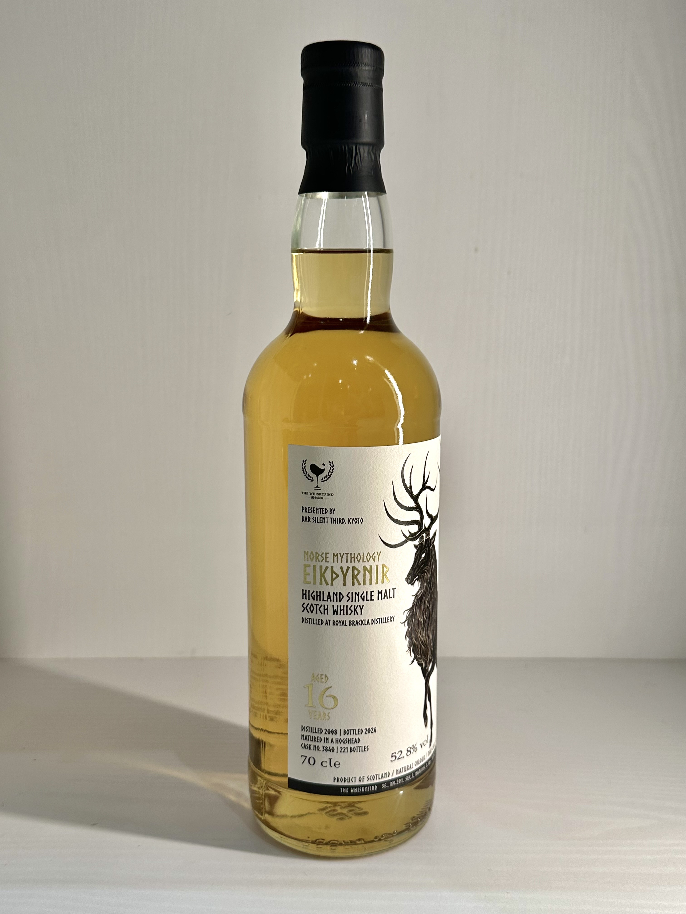
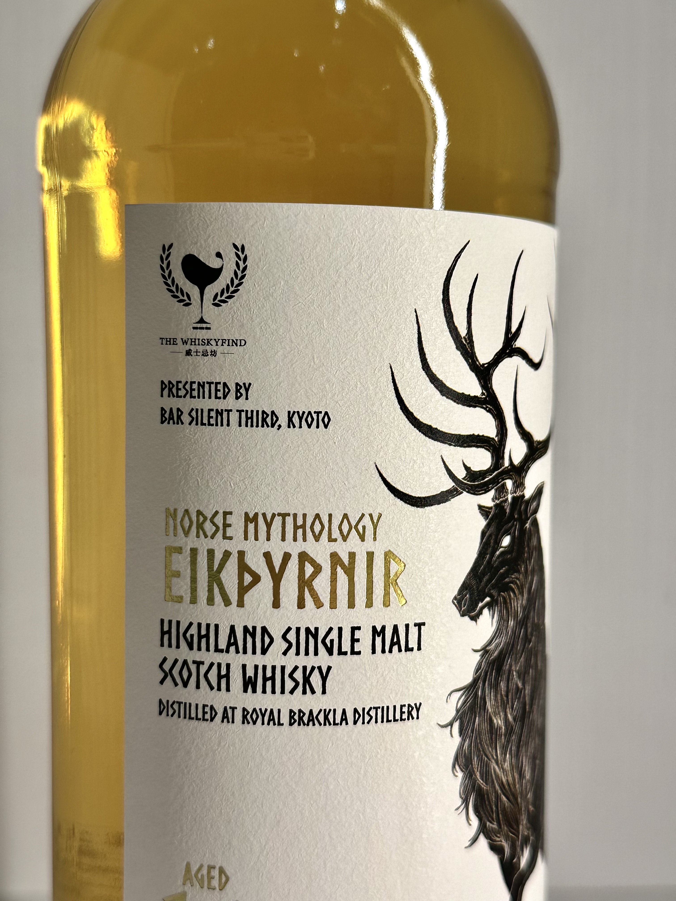
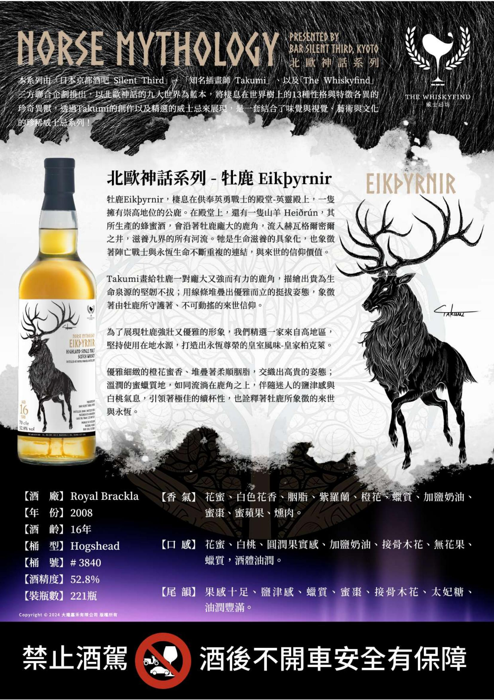

# 北歐神話 牡鹿 Royal Brackla WhiskyFind 2008 16yo HHD 52.8%

【香氣】黃金糖 麥芽糖 淡淡李子 富士蘋果  
【味道】奶油尤其奶油的油感跟creamy 特別明顯，有點蜜棗的奶香，酒體渾厚，剛開會辣，淡淡香草、稻梗  
【結語】稍稍覺得味道有點衝突，彼此之間沒有融合得很好，不過蜜棗味很渾厚  
【日期】2025.03.12  
【評分】85  
【價格】3xxx  

#royalbrackla
#hogshead
#whisky
#whiskey
#whiskyfind
#spicy9night

