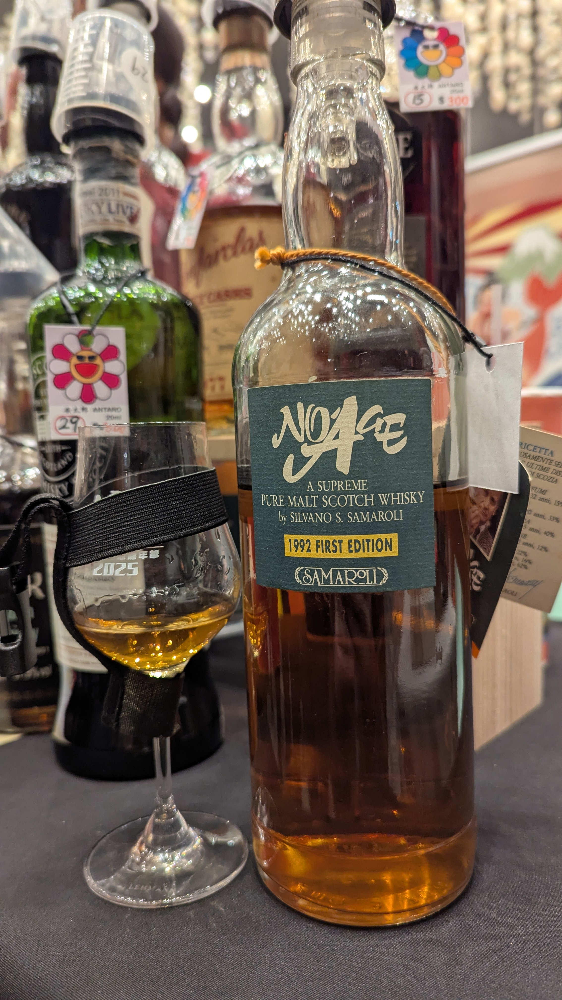
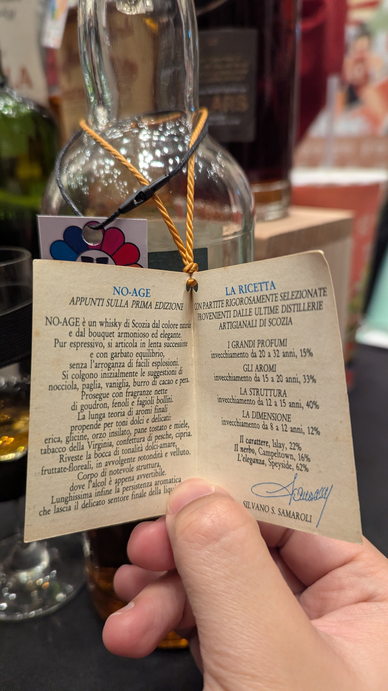
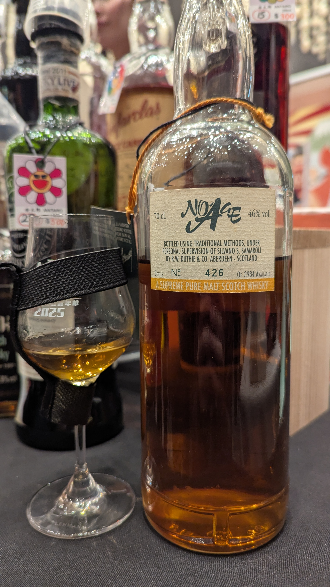
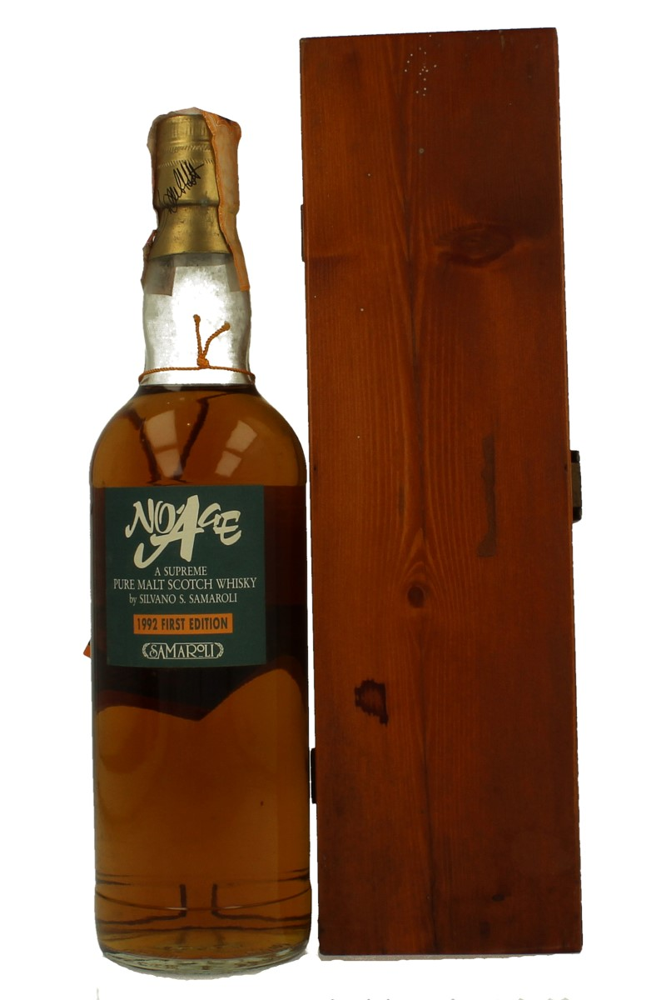
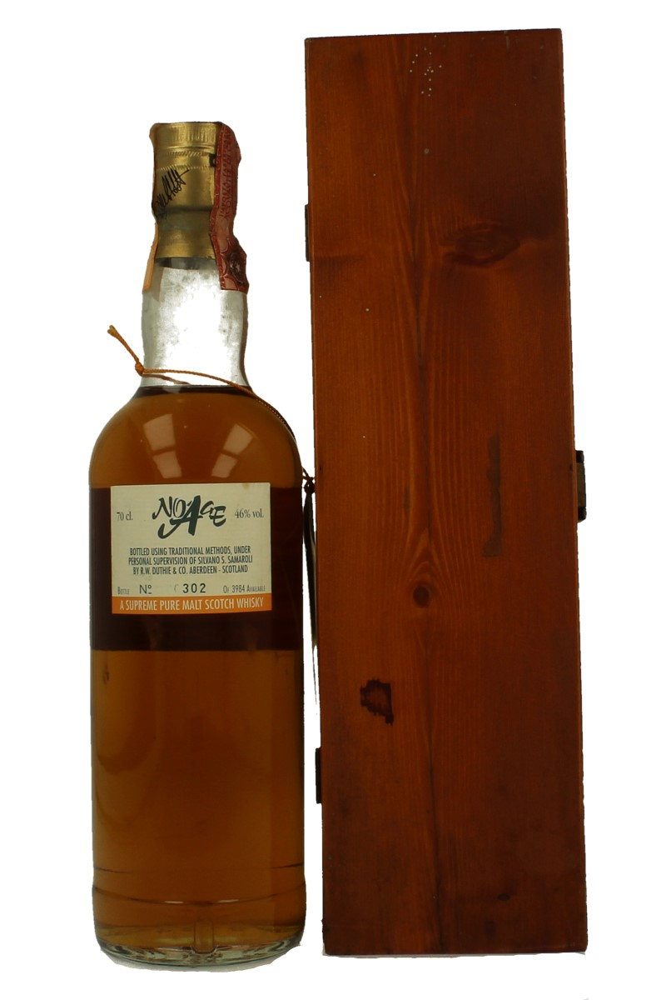

🥃
# No Age_First Edition Samaroli 46%

### 【香氣】杏桃
### 【味道】葡萄酒
### 【結語】色澤天然，帶有榛果、稻草、香草、可可脂與梨子的優雅香氣，餘韻悠長且平衡。
### 【日期】2025.11.22 @高雄酒展

這款酒由義大利傳奇裝瓶商 Silvano Samaroli 親自勾兌，打破了當時「年份越高越好」的迷思。

這瓶 1992 年的首版，其配方中據傳包含了 1960 年代的 Laphroaig (拉弗格) 與 1970 年代的 Springbank (雲頂) 等傳奇原酒。

產區配方： 

Speyside (62%)：    提供優雅感。

Islay (22%)：       提供性格與煙燻感。

Campbeltown (16%)： 提供酒體的深度與勁道。

年份結構比例：

20至32年 (15%)： 賦予「偉大的香氣 (I Grandi Profumi)」。

15至20年 (33%)： 構建「風味特徵 (Gli Aromi)」。

12至15年 (40%)： 作為「核心結構 (La Struttura)」。

8至12年 (12%)：  提供「活力與寬度 (La Dimensione)」。

#samaroli
#noage
#whisky
#whiskylover
#whiskey
#spicy9night

