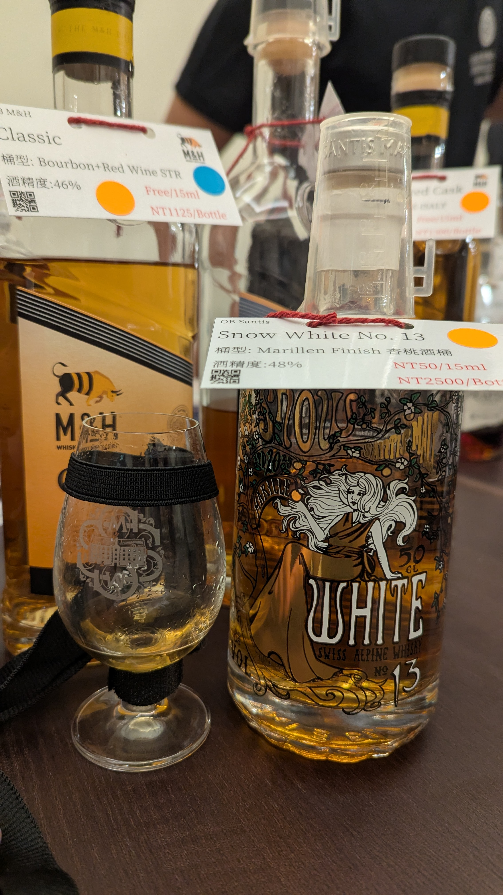

# Snow White No.13 Santis OB Marillen 杏桃酒桶 48%

### 【香氣】滿滿的杏桃香非常有特色，帶出熟果與果醬甜度，整體香氣濃郁又直接。
### 【味道】入口依舊是滿滿的杏桃，伴隨一點點硫感，但不影響整體甜點酒的角色，甜美果香和柔和酒體形成平衡。
### 【結語】這支 Santis OB 以 Marillen 杏桃酒桶風格鮮明，適合想嘗試果香型甜點酒的時候拿出來品，特色明確且值得一試。
### 【日期】2026.5.24
### 【評分】90
### 【價格】50

這款 Single Malt 原廠裝瓶由 Santis 釀造，Snow White No.13 系列本身就帶有故事性，48% 的強度讓杏桃風味保有濃郁度，同時不會讓甜感過於膩口。

#whisky #whiskylover #whiskey #spicy9night #santis

