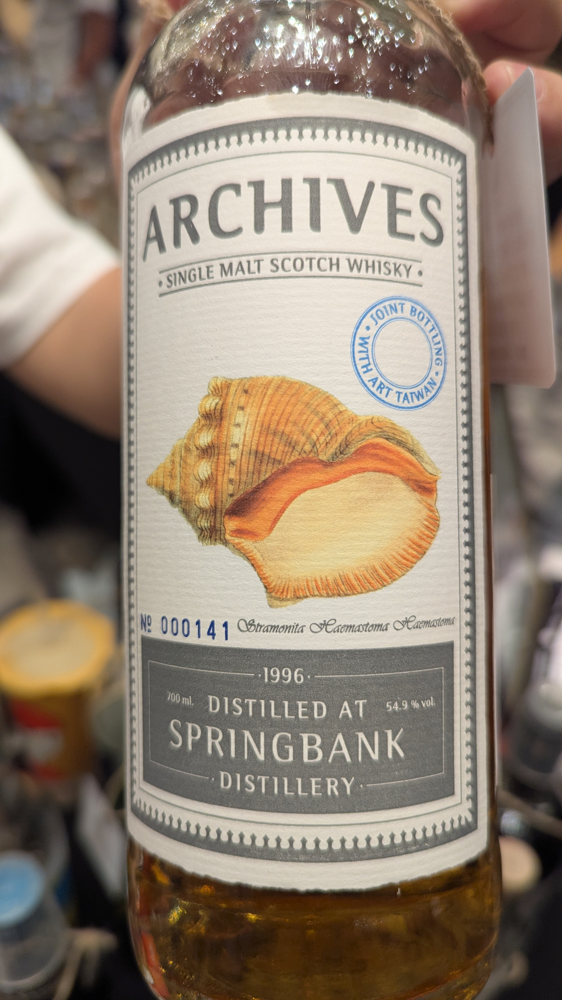
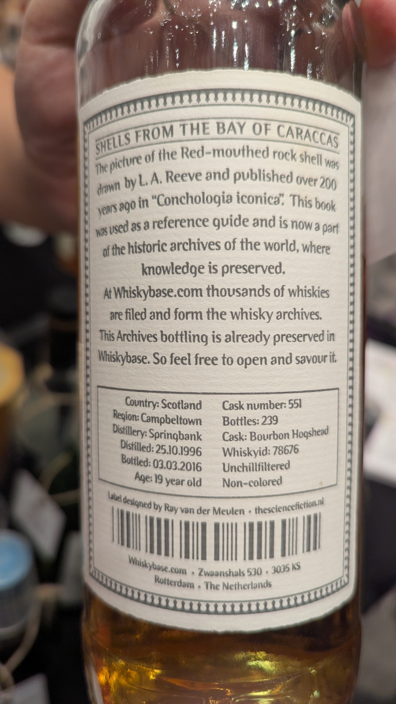

🥃
# Shells from the Bay of Caraccas Springbank Archives 1996 19yo Refill Bourbon HHD 54.9%

### 【結語】印象中很好喝
### 【日期】2025.11.22 @高雄酒展
### 【評分】90

傳奇年份 (1996)：

雲頂酒廠在 1996 年生產的原酒被公認為品質極高。這個年份的雲頂波本桶通常帶有極其迷人的熱帶水果（如芒果、鳳梨）風味，並結合了雲頂經典的礦石感與微量煙燻。

Archives 貝殼系列：

這是 Whiskybase 官方品牌 Archives 的指標系列，酒標採用 200 多年前古書《Conchologia iconica》中的科學繪圖（這款是紅口岩螺 Red-mouthed rock shell）。這個系列選桶眼光極其精準，幾乎每一款在 Whiskybase 上的評分都極高。

Art Taiwan 聯名：

酒標上的藍色圓形印章寫著 "Joint Bottling with Art Taiwan"。這是專門為台灣市場選桶的特別版，由林一峰老師親自挑選，代表這桶原酒符合台灣資深玩家偏好的豐富口感。

📝 品飲筆記預期
由於是 19 年的高年份雲頂波本桶，期待以下風味：

香氣： 鹹焦糖、香草、濃郁的熱帶水果、乾淨的皮革，以及些許海風的鹹味。

口感： 油脂感極重，像是融化的蠟質。椰奶、成熟芒果的甜度與胡椒香料感完美平衡。

餘韻： 非常長。帶有一種特殊的「雲頂土感」與乾淨的橡木辛香料，果甜味會持續繚繞。

#springbank
#archives
#bourbon
#whisky
#whiskylover
#whiskey
#spicy9night

