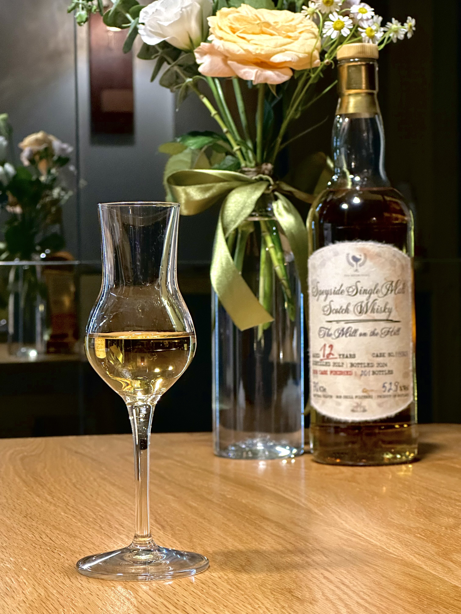
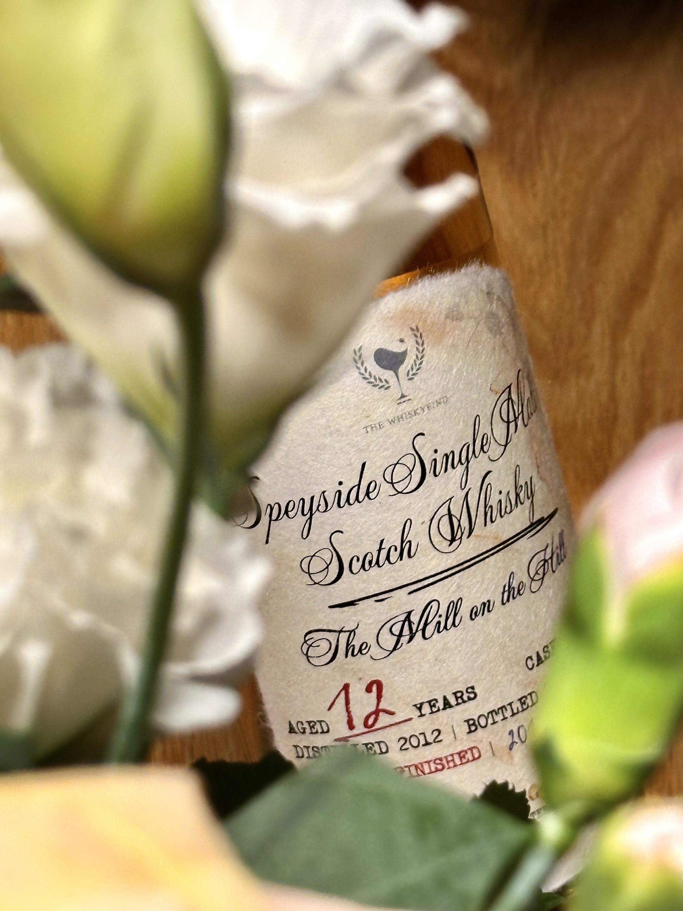
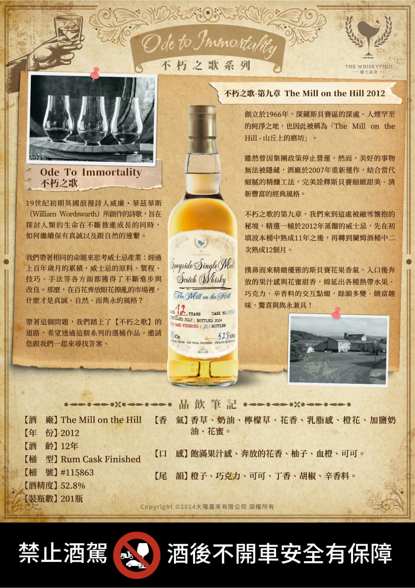
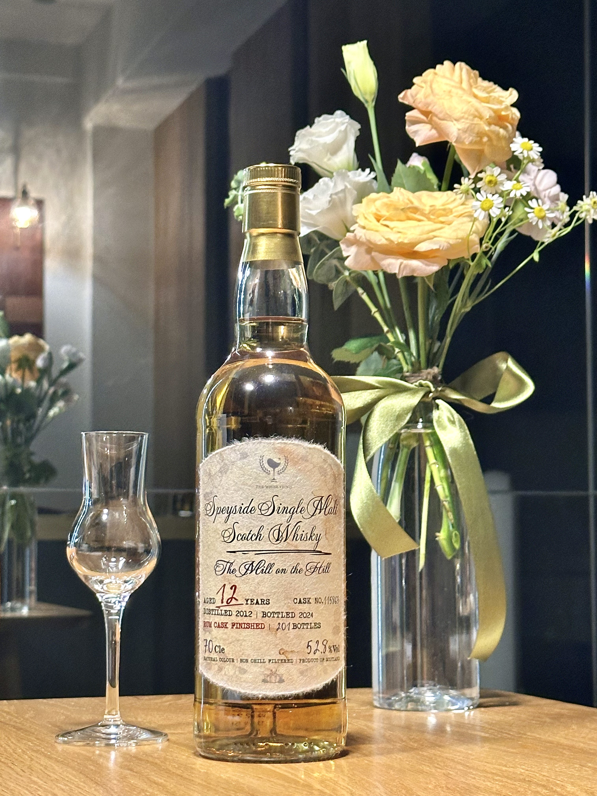
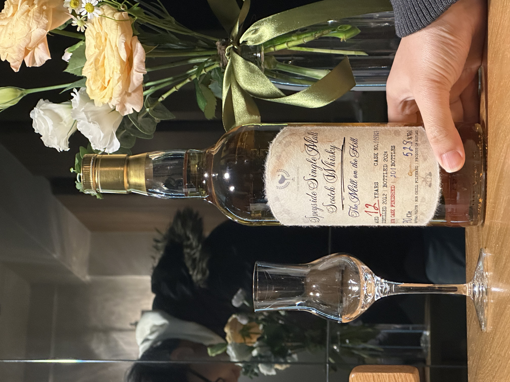

# 不朽之歌 第九章 Tamnavulin WhiskyFind 2012 12yo Rum 52.8%

【香氣】蜜蘋果 香檳葡萄 riesling 的汽油味 茶梅 醬油昆布 
【味道】滿酸的 蜜餞番茄 話梅 有時候有柚木的油臭味 放一下又沒了變成奶油爆米花的味道 香草  
【結語】香氣一下散掉了 中途一段味道變的滿差的，後續又變成滿滿奶油感，直接逆轉  
【日期】2025.03.17  
【評分】88  
【價格】2XXX  

#tamnavulin
#rumcask
#whisky
#whiskey
#whiskyfind
#spicy9night
#whiskylover

