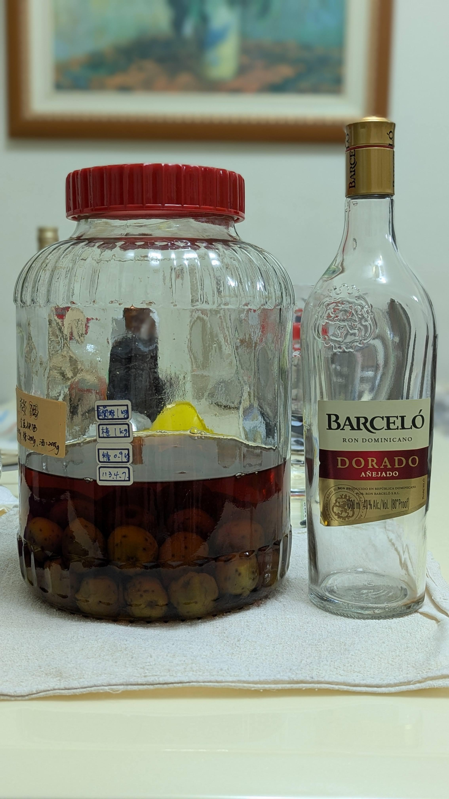

# 【自製梅酒】Barcelò, Dorado Rum 巴塞羅．金色蘭姆酒

🎉清明連假要幹嘛，當然是做梅酒阿!

## 配方
🍹 酒 1L  
⭐ 梅 1KG  
🍬 糖 0.9KG  
📅 釀造日期 113.4.7  
🥂 品飲日期 114.4.5  

## 風味
高酸度，富士蘋果的味道，  
金蘭姆從來不讓人失望  
是個做梅酒結果都很好的選擇  
跟白Rum 相比 會多一層果香以及一份蜂蜜感  

#spicy9night  
#辣酒  
#自製梅酒

