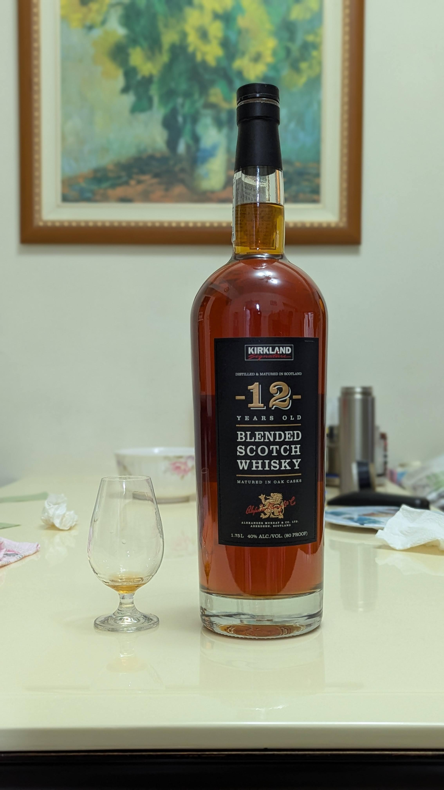

# 【自製梅酒】Kirkland 12yo Blended Whisky

🎉清明連假要幹嘛，當然是做梅酒阿!

## 配方
🍹 酒 1.75L  
⭐ 梅 1.5KG  
🍬 糖 1.8KG  
📅 釀造日期 113.4.7  
🥂 品飲日期 114.4.5

## 風味
酸甜滋味豐富，帶有點煙燻調性，青梅轉成烏梅感，其中有烏梅汁的味道  
這是今年收成結果的第一名，威士忌的辛辣感被完美青梅修飾圓滑，  
製作比例上梅子的量不多，口感沒有很酸，但是酸度很足夠，酸甜之後的生津量非常多   

#spicy9night  
#辣酒  
#自製梅酒

