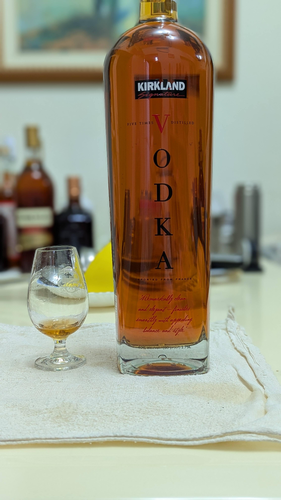
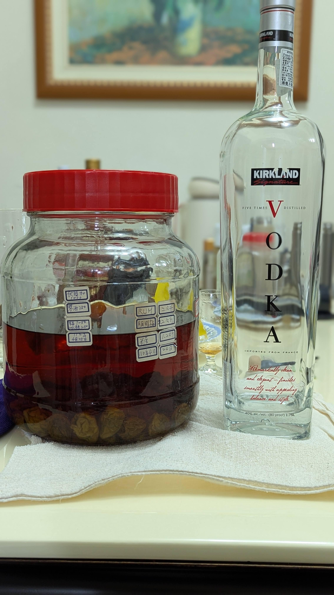

# 【自製梅酒】Vodka + Gin

🎉清明連假要幹嘛，當然是做梅酒阿!

## 配方
🍹 酒 伏特加1L 琴酒0.35L  
⭐ 梅 1.25KG  
🍬 糖 1.25KG  
📅 釀造日期 112.4.25   
🥂 品飲日期 114.4.5  

## 風味
去年的冠軍再泡一年  
今年有點掉漆  
這次收成唯一泡兩年的品項  
梅子的澀感都泡出來了  
相對辛口  
喜歡青蘋果香氣，青梅感(古道梅子綠茶的梅子感)重一點  
這款會很適合，是個相對清爽口感又快又順的品項  

#spicy9night  
#辣酒  
#自製梅酒

