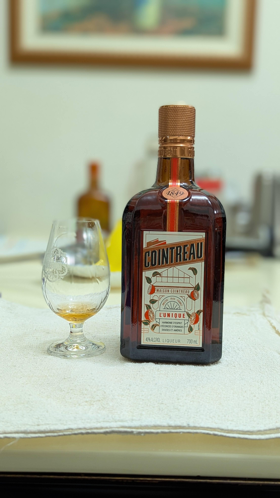

# 【自製梅酒】君度 Cointreau

🎉清明連假要幹嘛，當然是做梅酒阿!

## 配方  
🍹 酒 0.7L  
⭐ 梅 0.7KG  
🍬 糖 0.35KG  
📅 釀造日期 113.4.7  
🥂 品飲日期 114.4.5    

## 風味
熟悉的味道  
柑橘佐梅子  
偶爾一杯shot 口齒留香  
每年固定會做一瓶   
而且還是無麩質!!  

#spicy9night  
#辣酒  
#自製梅酒

