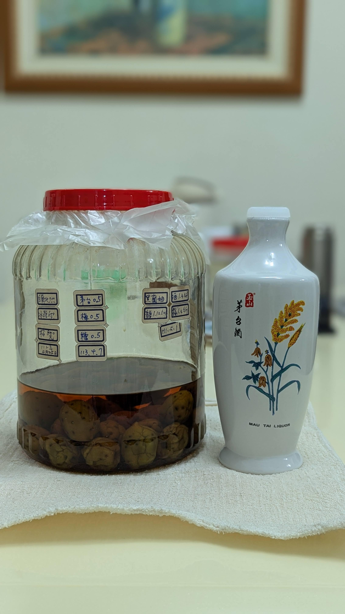

# 【自製梅酒】玉山茅台

🎉清明連假要幹嘛，當然是做梅酒阿!

## 配方  
🍹 酒 0.5L  
⭐ 梅 0.5KG  
🍬 糖 0.5KG  
📅 釀造日期 113.4.7  
🥂 品飲日期 114.4.5    

## 風味
剛開出來的時候跟鬼一樣有夠臭，滿滿路邊醉死酒鬼的味道  
喝下去不會臭，莫非這是梅酒界臭豆腐?!  
還有點好喝回甘，有米酒加強版的香味，米香回甘  
放了一下也不臭了，反而有蘋果西打的香氣與味道，  
彷彿還帶有一絲絲的氣泡感，質地輕盈  
我認為是個比高粱更好喝的選擇  

#spicy9night  
#辣酒  
#自製梅酒

